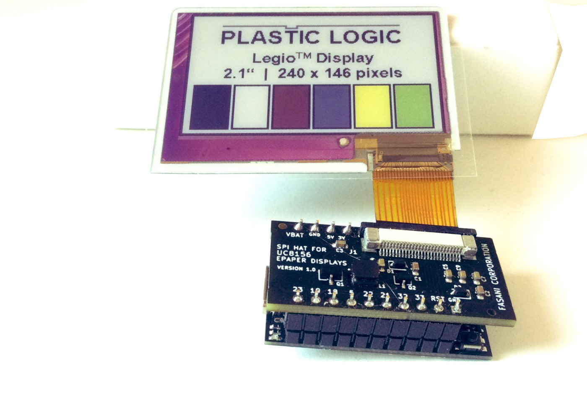
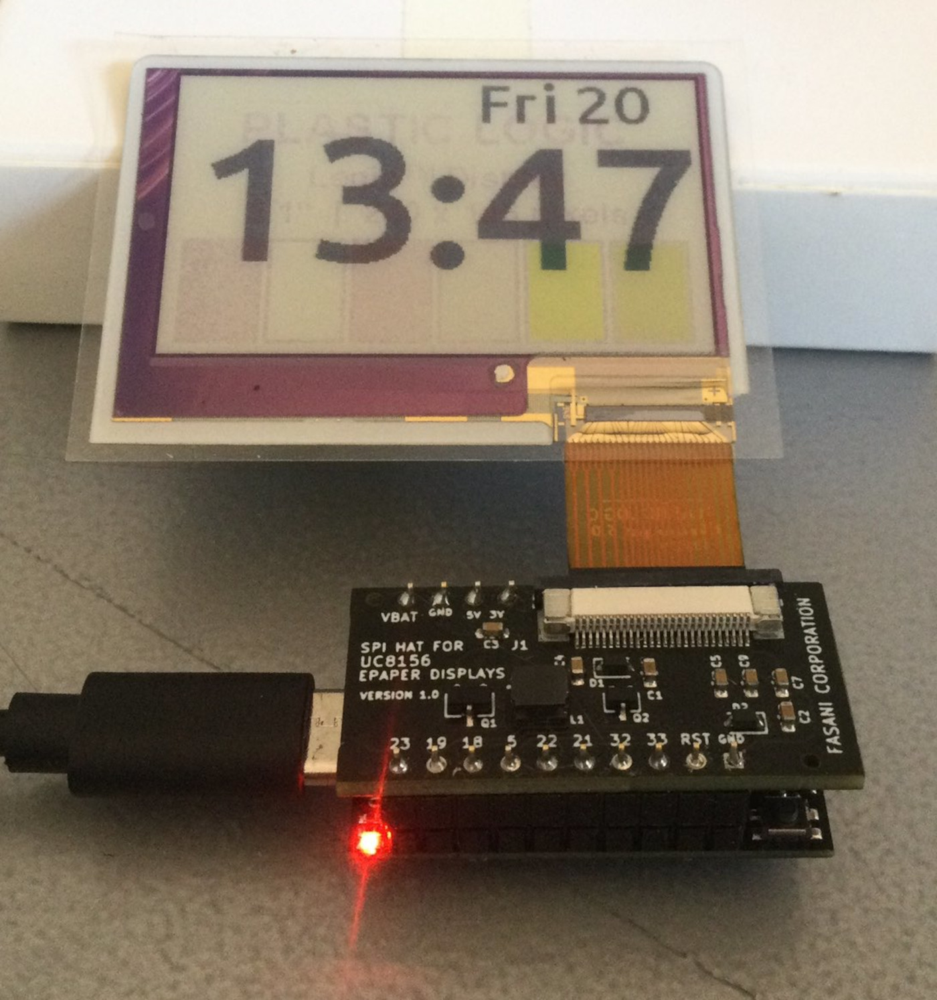

## PlasticLogic flexible color deepsleep clock

A very easy deepsleep clock ported from an [ESP-IDF example](https://github.com/martinberlin/cale-idf/blob/master/main/demo-sleep-clock-v2.cpp) to Arduino. It uses [Plastic Logic 2.1" Legio flexible color epaper display](https://www.plasticlogic.com/products/displays/displays-with-ultrachip/2-1-inch-colour-display).
Simply makes an internet Sync a day and stores the time in NVS. Each X minutes, defined in global variable **sleepMinutes**, it wakes up and retrieves the date from NVS just to add this minutes rendering the display and repeating the process.

This sketch uses Robert Poser [PL_microEPD](https://github.com/RobPo/Paperino) library added locally with custom modifications. As it is right now the clock will only use monochrome 4 levels of gray.
To achieve colors in the display, we need to switch to the [PlasticLogic PL_smallLegio C++ class](https://github.com/plasticlogic/PL_smallEPD/tree/main/src), which talks with UC8156 to use different voltages for each of the 5 available colors (6th is white)

## Requirements

Latest Arduino-esp32 added in Arduino IDE -> Preferences -> Additional board URLS

     https://raw.githubusercontent.com/espressif/arduino-esp32/gh-pages/package_esp32_index.json

- Adafruit GFX added as a global library
- A [PlasticLogic.com/sampleshop UC8156 color epaper display](https://www.plasticlogic.com/products/displays/displays-with-ultrachip/2-1-inch-colour-display) (2.1 inches)

## Configuration

Simply open the **colorino_epaper_clock.ino** in Arduino IDE and set up points 1 to 3:

- 1 Edit in Pl_microEPD.h the right EPD_WIDTH / EPD_HEIGHT for Adafruit GFX instantiation (As default 2.1" size: 240*146)
- 2 Update the ESP_WIFI* Credentials so it can connect to the internet
- 3 Flash with forceSync=true on first run so the right time is stored in NVS

